# SCHEMA.md — Optimus SEO Database Design

> **Version:** 1.0 | **Date:** 2026-03-13
> **Status:** Draft — Awaiting Approval
> **Stack:** PostgreSQL 16 + Prisma 7 (TypeScript) / SQLAlchemy (Python FastAPI)

---

## 1. DATABASE CHOICE JUSTIFICATION

### Why PostgreSQL
- **Industry standard** for SaaS applications — battle-tested at scale
- **JSON/JSONB support** — essential for storing flexible agent outputs, review criteria, configurator settings
- **Full-text search** — keyword search, content search without external service
- **PGVector extension** — future-ready for embeddings/RAG if needed
- **Railway native support** — first-class PostgreSQL hosting on our deployment platform
- **Prisma + SQLAlchemy support** — works with both our TypeScript frontend ORM and Python backend ORM

### Why Prisma ORM (TypeScript side)
- **Type-safe queries** — auto-generated TypeScript types from schema
- **Migration system** — version-controlled, reproducible migrations
- **Relation handling** — clean API for complex joins
- **Ecosystem** — largest TypeScript ORM community, excellent docs

### Why SQLAlchemy (Python/FastAPI side)
- **Python standard** — most mature Python ORM
- **Async support** — works with FastAPI's async architecture
- **Shared schema** — Prisma generates the schema, SQLAlchemy reads it (single source of truth)

---

## 2. ENTITY RELATIONSHIP DIAGRAM

```mermaid
erDiagram
    Organization ||--o{ User : "has members"
    Organization ||--o{ ApiKey : "owns"
    Organization ||--o{ Integration : "connects"
    Organization ||--o{ Project : "manages"
    Organization ||--o{ OrgSetting : "configures"
    Organization ||--o{ ContentReviewCriteria : "defines"
    Organization ||--o{ PricingPlan : "subscribes to"

    User ||--o{ Session : "has"
    User ||--o{ Notification : "receives"
    User ||--o{ ApprovalQueue : "assigned to"

    Project ||--o{ ProjectLocation : "targets"
    Project ||--o{ Competitor : "tracks"
    Project ||--o{ ProjectSetting : "configures"

    Project ||--o{ SiteAudit : "audited by"
    SiteAudit ||--o{ SiteAuditIssue : "contains"

    Project ||--o{ KeywordOverview : "has overview"
    Project ||--o{ CompetitorOverview : "has overview"
    Project ||--o{ PpcIntelligence : "has ppc data"
    Project ||--o{ AiVisibilityCheck : "has ai check"
    Project ||--o{ GmbAnalysis : "has gmb data"
    Project ||--o{ PitchDeck : "generates"
    Project ||--o{ Proposal : "generates"

    Project ||--o{ KeywordCluster : "has clusters"
    KeywordCluster ||--o{ Keyword : "contains"
    Project ||--o{ Keyword : "researches"
    Project ||--o{ CompetitorAnalysis : "analyzes"
    Project ||--o{ WebsiteStructure : "maps"
    WebsiteStructure ||--o{ SuggestedPage : "suggests"
    SuggestedPage ||--o{ ContentBrief : "has brief"
    Project ||--o{ LinkBuildingStrategy : "plans"

    Project ||--o{ Content : "creates"
    Content ||--o{ ContentReviewResult : "reviewed by"
    ContentReviewCriteria ||--o{ ContentReviewResult : "scored against"

    Project ||--o{ BacklinkOpportunity : "discovers"
    BacklinkOpportunity ||--o{ BacklinkSubmission : "submitted to"
    Content ||--o{ BacklinkSubmission : "used in"

    Project ||--o{ OnPageTask : "fixes"
    Project ||--o{ GmbPost : "posts"
    Project ||--o{ GmbReviewResponse : "responds"

    Project ||--o{ RankTracking : "tracks"
    Project ||--o{ RankTrackingConfig : "configures"
    Project ||--o{ TrafficData : "measures"
    Project ||--o{ AiVisibilityReport : "monitors"
    Project ||--o{ ClientReport : "reports"
    Project ||--o{ ShareOfVoice : "tracks sov"

    Project ||--o{ AgentTask : "runs"
    AgentTask ||--o{ AgentLog : "logs"
    Project ||--o{ ApprovalQueue : "queues"

    ProjectLocation }o--|| Location : "references"
```



---

## 3. TABLE DEFINITIONS

### 3.1 Core Tables

---

#### Organization

The root tenant entity. Even for single-tenant MVP, every data entity references an organization for future multi-tenancy.

| Column | Type | Constraints | Default | Description |
|--------|------|-------------|---------|-------------|
| id | UUID | PK | gen_random_uuid() | Primary key |
| name | VARCHAR(255) | NOT NULL | — | Organization name |
| slug | VARCHAR(100) | UNIQUE, NOT NULL | — | URL-safe identifier |
| logoUrl | TEXT | NULLABLE | NULL | Logo URL for branding |
| primaryColor | VARCHAR(7) | NULLABLE | '#FF6B35' | Brand primary color (hex) |
| customDomain | VARCHAR(255) | NULLABLE, UNIQUE | NULL | Custom domain (SaaS phase) |
| stripeCustomerId | VARCHAR(255) | NULLABLE | NULL | Stripe customer ID |
| stripeSubscriptionId | VARCHAR(255) | NULLABLE | NULL | Stripe subscription ID |
| subscriptionStatus | VARCHAR(50) | NOT NULL | 'trial' | trial, active, past_due, cancelled |
| planId | UUID | FK → PricingPlan | NULL | Current plan |
| trialEndsAt | TIMESTAMP | NULLABLE | NOW() + 14 days | Trial expiry |
| dataforseoLogin | TEXT | NULLABLE, ENCRYPTED | NULL | DataForSEO API login |
| dataforseoPassword | TEXT | NULLABLE, ENCRYPTED | NULL | DataForSEO API password |
| monthlyApibudget | INTEGER | NULLABLE | NULL | Monthly DataForSEO budget cap (cents) |
| createdAt | TIMESTAMP | NOT NULL | NOW() | — |
| updatedAt | TIMESTAMP | NOT NULL | NOW() | — |
| deletedAt | TIMESTAMP | NULLABLE | NULL | Soft delete |

**Indexes:**
- `idx_org_slug` UNIQUE on `slug` — fast lookup by slug
- `idx_org_stripe` on `stripeCustomerId` — webhook lookups

---

#### User

| Column | Type | Constraints | Default | Description |
|--------|------|-------------|---------|-------------|
| id | UUID | PK | gen_random_uuid() | — |
| organizationId | UUID | FK → Organization, NOT NULL | — | Tenant scope |
| email | VARCHAR(255) | UNIQUE, NOT NULL | — | Login email |
| name | VARCHAR(255) | NOT NULL | — | Display name |
| avatarUrl | TEXT | NULLABLE | NULL | Profile picture |
| role | UserRole (ENUM) | NOT NULL | 'executive' | User role |
| isActive | BOOLEAN | NOT NULL | true | Account active |
| lastLoginAt | TIMESTAMP | NULLABLE | NULL | — |
| createdAt | TIMESTAMP | NOT NULL | NOW() | — |
| updatedAt | TIMESTAMP | NOT NULL | NOW() | — |
| deletedAt | TIMESTAMP | NULLABLE | NULL | Soft delete |

**Indexes:**
- `idx_user_email` UNIQUE on `email`
- `idx_user_org` on `organizationId` — tenant queries
- `idx_user_org_role` on `(organizationId, role)` — role-based queries

---

#### Session

| Column | Type | Constraints | Default | Description |
|--------|------|-------------|---------|-------------|
| id | UUID | PK | gen_random_uuid() | — |
| userId | UUID | FK → User, NOT NULL | — | — |
| token | VARCHAR(500) | UNIQUE, NOT NULL | — | Session token (hashed) |
| expiresAt | TIMESTAMP | NOT NULL | — | Expiry time |
| ipAddress | VARCHAR(45) | NULLABLE | NULL | — |
| userAgent | TEXT | NULLABLE | NULL | — |
| createdAt | TIMESTAMP | NOT NULL | NOW() | — |

**Indexes:**
- `idx_session_token` UNIQUE on `token`
- `idx_session_user` on `userId`
- `idx_session_expires` on `expiresAt` — cleanup queries

---

#### ApiKey (BYOK)

| Column | Type | Constraints | Default | Description |
|--------|------|-------------|---------|-------------|
| id | UUID | PK | gen_random_uuid() | — |
| organizationId | UUID | FK → Organization, NOT NULL | — | — |
| provider | LlmProvider (ENUM) | NOT NULL | — | anthropic, openai, google, etc. |
| encryptedKey | TEXT | NOT NULL | — | AES-256 encrypted API key |
| label | VARCHAR(100) | NULLABLE | NULL | User-friendly label |
| isActive | BOOLEAN | NOT NULL | true | — |
| lastUsedAt | TIMESTAMP | NULLABLE | NULL | — |
| createdAt | TIMESTAMP | NOT NULL | NOW() | — |
| updatedAt | TIMESTAMP | NOT NULL | NOW() | — |

**Indexes:**
- `idx_apikey_org_provider` on `(organizationId, provider)` — lookup by org + provider

---

#### Integration

| Column | Type | Constraints | Default | Description |
|--------|------|-------------|---------|-------------|
| id | UUID | PK | gen_random_uuid() | — |
| organizationId | UUID | FK → Organization, NOT NULL | — | — |
| type | VARCHAR(50) | NOT NULL | — | 'google_search_console', 'google_analytics', 'google_business_profile' |
| accessToken | TEXT | ENCRYPTED | — | OAuth access token |
| refreshToken | TEXT | ENCRYPTED | — | OAuth refresh token |
| tokenExpiresAt | TIMESTAMP | NULLABLE | NULL | — |
| accountId | VARCHAR(255) | NULLABLE | NULL | External account identifier |
| metadata | JSONB | NULLABLE | '{}' | Additional connection data |
| isActive | BOOLEAN | NOT NULL | true | — |
| createdAt | TIMESTAMP | NOT NULL | NOW() | — |
| updatedAt | TIMESTAMP | NOT NULL | NOW() | — |

**Indexes:**
- `idx_integration_org_type` on `(organizationId, type)`

---

### 3.2 Project Tables

---

#### Project

| Column | Type | Constraints | Default | Description |
|--------|------|-------------|---------|-------------|
| id | UUID | PK | gen_random_uuid() | — |
| organizationId | UUID | FK → Organization, NOT NULL | — | Tenant scope |
| name | VARCHAR(255) | NOT NULL | — | Client/project name |
| clientUrl | VARCHAR(500) | NOT NULL | — | Client website URL |
| industry | VARCHAR(100) | NULLABLE | NULL | Industry/niche |
| description | TEXT | NULLABLE | NULL | Project description |
| status | ProjectStatus (ENUM) | NOT NULL | 'created' | Current phase |
| healthScore | INTEGER | NULLABLE | NULL | Overall SEO health (0-100) |
| createdById | UUID | FK → User | — | Who created it |
| createdAt | TIMESTAMP | NOT NULL | NOW() | — |
| updatedAt | TIMESTAMP | NOT NULL | NOW() | — |
| deletedAt | TIMESTAMP | NULLABLE | NULL | Soft delete |

**Indexes:**
- `idx_project_org` on `organizationId`
- `idx_project_org_status` on `(organizationId, status)`

---

#### Location (Cached from DataForSEO)

| Column | Type | Constraints | Default | Description |
|--------|------|-------------|---------|-------------|
| id | UUID | PK | gen_random_uuid() | — |
| locationCode | INTEGER | UNIQUE, NOT NULL | — | DataForSEO location_code |
| locationName | VARCHAR(255) | NOT NULL | — | Full location name |
| locationType | VARCHAR(50) | NOT NULL | — | Country, Region, City, DMA |
| countryCode | VARCHAR(5) | NULLABLE | NULL | ISO country code |
| countryName | VARCHAR(100) | NULLABLE | NULL | — |
| parentLocationCode | INTEGER | NULLABLE | NULL | Parent location |
| languageCode | VARCHAR(10) | NULLABLE | NULL | Default language |
| languageName | VARCHAR(100) | NULLABLE | NULL | — |

**Indexes:**
- `idx_location_code` UNIQUE on `locationCode` — API lookups
- `idx_location_country` on `countryCode` — country filtering
- `idx_location_name` GIN on `locationName` — search/autocomplete

---

#### ProjectLocation

| Column | Type | Constraints | Default | Description |
|--------|------|-------------|---------|-------------|
| id | UUID | PK | gen_random_uuid() | — |
| projectId | UUID | FK → Project, NOT NULL | — | — |
| locationId | UUID | FK → Location, NOT NULL | — | — |
| isPrimary | BOOLEAN | NOT NULL | false | Primary target location |

**Indexes:**
- `idx_projloc_project` on `projectId`
- `idx_projloc_unique` UNIQUE on `(projectId, locationId)`

---

#### Competitor

| Column | Type | Constraints | Default | Description |
|--------|------|-------------|---------|-------------|
| id | UUID | PK | gen_random_uuid() | — |
| projectId | UUID | FK → Project, NOT NULL | — | — |
| url | VARCHAR(500) | NOT NULL | — | Competitor URL |
| name | VARCHAR(255) | NULLABLE | NULL | Competitor name |
| isAutoDiscovered | BOOLEAN | NOT NULL | false | Found by agent vs user-provided |
| domainAuthority | INTEGER | NULLABLE | NULL | DA score |
| organicTraffic | INTEGER | NULLABLE | NULL | Estimated monthly traffic |
| createdAt | TIMESTAMP | NOT NULL | NOW() | — |

**Indexes:**
- `idx_competitor_project` on `projectId`

---

### 3.3 Sales Phase Tables

---

#### SiteAudit

| Column | Type | Constraints | Default | Description |
|--------|------|-------------|---------|-------------|
| id | UUID | PK | gen_random_uuid() | — |
| projectId | UUID | FK → Project, NOT NULL | — | — |
| organizationId | UUID | FK → Organization, NOT NULL | — | Tenant scope |
| healthScore | INTEGER | NULLABLE | NULL | Overall score 0-100 |
| pagesCrawled | INTEGER | NOT NULL | 0 | — |
| lighthousePerformance | FLOAT | NULLABLE | NULL | 0-100 |
| lighthouseAccessibility | FLOAT | NULLABLE | NULL | 0-100 |
| lighthouseSeo | FLOAT | NULLABLE | NULL | 0-100 |
| lighthouseBestPractices | FLOAT | NULLABLE | NULL | 0-100 |
| coreWebVitals | JSONB | NULLABLE | '{}' | LCP, FID, CLS data |
| mobileScore | FLOAT | NULLABLE | NULL | Mobile performance |
| desktopScore | FLOAT | NULLABLE | NULL | Desktop performance |
| schemaMarkupFound | JSONB | NULLABLE | '[]' | Schema types found |
| toxicBacklinksCount | INTEGER | NULLABLE | NULL | Spam backlinks |
| rawData | JSONB | NULLABLE | '{}' | Full DataForSEO response |
| summaryNarrative | TEXT | NULLABLE | NULL | LLM-generated summary |
| agentTaskId | UUID | FK → AgentTask | NULL | Agent that ran this |
| createdAt | TIMESTAMP | NOT NULL | NOW() | — |

**Indexes:**
- `idx_audit_project` on `projectId`
- `idx_audit_org` on `organizationId`

---

#### SiteAuditIssue

| Column | Type | Constraints | Default | Description |
|--------|------|-------------|---------|-------------|
| id | UUID | PK | gen_random_uuid() | — |
| siteAuditId | UUID | FK → SiteAudit, NOT NULL | — | — |
| severity | AuditIssueSeverity (ENUM) | NOT NULL | — | critical/high/medium/low/info |
| category | VARCHAR(100) | NOT NULL | — | 'meta_tags', 'links', 'speed', 'mobile', etc. |
| title | VARCHAR(500) | NOT NULL | — | Issue title |
| description | TEXT | NOT NULL | — | Detailed description |
| pageUrl | VARCHAR(500) | NULLABLE | NULL | Affected page |
| recommendation | TEXT | NULLABLE | NULL | Fix recommendation |
| isFixed | BOOLEAN | NOT NULL | false | Tracked fix status |

**Indexes:**
- `idx_auditissue_audit` on `siteAuditId`
- `idx_auditissue_severity` on `(siteAuditId, severity)`

---

#### KeywordOverview (Sales-level ~100 keywords)

| Column | Type | Constraints | Default | Description |
|--------|------|-------------|---------|-------------|
| id | UUID | PK | gen_random_uuid() | — |
| projectId | UUID | FK → Project, NOT NULL | — | — |
| organizationId | UUID | FK → Organization, NOT NULL | — | — |
| keyword | VARCHAR(500) | NOT NULL | — | Keyword text |
| serpPosition | INTEGER | NULLABLE | NULL | Current SERP position (1-30) |
| searchVolume | INTEGER | NULLABLE | NULL | Monthly search volume |
| estimatedTraffic | FLOAT | NULLABLE | NULL | Estimated monthly traffic |
| cpc | FLOAT | NULLABLE | NULL | Cost per click |
| difficulty | INTEGER | NULLABLE | NULL | Keyword difficulty 0-100 |
| keywordType | KeywordType (ENUM) | NULLABLE | NULL | short_tail/long_tail/generic/branded |
| intent | KeywordIntent (ENUM) | NULLABLE | NULL | commercial/informational/navigational/transactional |
| hasFeaturedSnippet | BOOLEAN | NOT NULL | false | Snippet opportunity |
| paaQuestions | JSONB | NULLABLE | '[]' | People Also Ask questions |
| createdAt | TIMESTAMP | NOT NULL | NOW() | — |

**Indexes:**
- `idx_kwoverview_project` on `projectId`
- `idx_kwoverview_org` on `organizationId`

---

#### CompetitorOverview

| Column | Type | Constraints | Default | Description |
|--------|------|-------------|---------|-------------|
| id | UUID | PK | gen_random_uuid() | — |
| projectId | UUID | FK → Project, NOT NULL | — | — |
| organizationId | UUID | FK → Organization, NOT NULL | — | — |
| competitorId | UUID | FK → Competitor | NULL | — |
| domainAuthority | INTEGER | NULLABLE | NULL | — |
| totalBacklinks | INTEGER | NULLABLE | NULL | — |
| referringDomains | INTEGER | NULLABLE | NULL | — |
| organicKeywords | INTEGER | NULLABLE | NULL | — |
| estimatedTraffic | INTEGER | NULLABLE | NULL | — |
| trafficCost | FLOAT | NULLABLE | NULL | Traffic value in USD |
| linkGapDomains | JSONB | NULLABLE | '[]' | Top 20 link gap domains |
| contentGapKeywords | JSONB | NULLABLE | '[]' | Top 20 content gap keywords |
| shareOfVoice | FLOAT | NULLABLE | NULL | % of target keywords in top 10 |
| createdAt | TIMESTAMP | NOT NULL | NOW() | — |

**Indexes:**
- `idx_compoverview_project` on `projectId`

---

#### PpcIntelligence

| Column | Type | Constraints | Default | Description |
|--------|------|-------------|---------|-------------|
| id | UUID | PK | gen_random_uuid() | — |
| projectId | UUID | FK → Project, NOT NULL | — | — |
| organizationId | UUID | FK → Organization, NOT NULL | — | — |
| totalEstimatedAdSpend | FLOAT | NULLABLE | NULL | Monthly estimated spend |
| topAdvertisers | JSONB | NULLABLE | '[]' | Competitor ad data |
| keywordAdData | JSONB | NULLABLE | '[]' | Per-keyword CPC, competition, trends |
| bingAdData | JSONB | NULLABLE | '[]' | Bing-specific data |
| adCopyExamples | JSONB | NULLABLE | '[]' | Competitor ad copy |
| createdAt | TIMESTAMP | NOT NULL | NOW() | — |

**Indexes:**
- `idx_ppc_project` on `projectId`

---

#### AiVisibilityCheck

| Column | Type | Constraints | Default | Description |
|--------|------|-------------|---------|-------------|
| id | UUID | PK | gen_random_uuid() | — |
| projectId | UUID | FK → Project, NOT NULL | — | — |
| organizationId | UUID | FK → Organization, NOT NULL | — | — |
| aiVisibilityScore | INTEGER | NULLABLE | NULL | 0-100 |
| mentionsChatgpt | INTEGER | NULLABLE | 0 | — |
| mentionsClaude | INTEGER | NULLABLE | 0 | — |
| mentionsGemini | INTEGER | NULLABLE | 0 | — |
| mentionsPerplexity | INTEGER | NULLABLE | 0 | — |
| totalImpressions | INTEGER | NULLABLE | 0 | — |
| topMentionedDomains | JSONB | NULLABLE | '[]' | Competitor domains in AI |
| topCitedPages | JSONB | NULLABLE | '[]' | Pages cited by LLMs |
| recommendations | TEXT | NULLABLE | NULL | LLM-generated recommendations |
| rawData | JSONB | NULLABLE | '{}' | Full API response |
| createdAt | TIMESTAMP | NOT NULL | NOW() | — |

**Indexes:**
- `idx_aivisibility_project` on `projectId`

---

#### GmbAnalysis

| Column | Type | Constraints | Default | Description |
|--------|------|-------------|---------|-------------|
| id | UUID | PK | gen_random_uuid() | — |
| projectId | UUID | FK → Project, NOT NULL | — | — |
| organizationId | UUID | FK → Organization, NOT NULL | — | — |
| businessName | VARCHAR(255) | NULLABLE | NULL | — |
| rating | FLOAT | NULLABLE | NULL | Google rating |
| reviewCount | INTEGER | NULLABLE | 0 | — |
| reviewSentiment | JSONB | NULLABLE | '{}' | Positive/negative/neutral counts |
| categories | JSONB | NULLABLE | '[]' | Business categories |
| isInLocalPack | BOOLEAN | NOT NULL | false | Appears in local 3-pack |
| napConsistency | JSONB | NULLABLE | '{}' | Name/Address/Phone check |
| competitorGmb | JSONB | NULLABLE | '[]' | Competitor GMB comparison |
| localSeoScore | INTEGER | NULLABLE | NULL | 0-100 |
| rawData | JSONB | NULLABLE | '{}' | — |
| createdAt | TIMESTAMP | NOT NULL | NOW() | — |

**Indexes:**
- `idx_gmb_project` on `projectId`

---

#### PitchDeck

| Column | Type | Constraints | Default | Description |
|--------|------|-------------|---------|-------------|
| id | UUID | PK | gen_random_uuid() | — |
| projectId | UUID | FK → Project, NOT NULL | — | — |
| organizationId | UUID | FK → Organization, NOT NULL | — | — |
| version | INTEGER | NOT NULL | 1 | Version number |
| filePath | TEXT | NULLABLE | NULL | Generated file path |
| format | ReportFormat (ENUM) | NOT NULL | 'ppt' | — |
| status | VARCHAR(50) | NOT NULL | 'generating' | generating/ready/sent |
| sentAt | TIMESTAMP | NULLABLE | NULL | — |
| createdById | UUID | FK → User | NULL | — |
| createdAt | TIMESTAMP | NOT NULL | NOW() | — |

**Indexes:**
- `idx_pitch_project` on `projectId`

---

#### Proposal

| Column | Type | Constraints | Default | Description |
|--------|------|-------------|---------|-------------|
| id | UUID | PK | gen_random_uuid() | — |
| projectId | UUID | FK → Project, NOT NULL | — | — |
| organizationId | UUID | FK → Organization, NOT NULL | — | — |
| scopeOfWork | TEXT | NULLABLE | NULL | Generated scope |
| recommendedPlan | VARCHAR(100) | NULLABLE | NULL | — |
| timeline | TEXT | NULLABLE | NULL | — |
| pricing | JSONB | NULLABLE | '{}' | Pricing breakdown |
| filePath | TEXT | NULLABLE | NULL | Generated PDF path |
| status | VARCHAR(50) | NOT NULL | 'draft' | draft/approved/sent |
| createdAt | TIMESTAMP | NOT NULL | NOW() | — |

**Indexes:**
- `idx_proposal_project` on `projectId`

---

### 3.4 Strategy Phase Tables

---

#### Keyword (Extensive — full universe)

| Column | Type | Constraints | Default | Description |
|--------|------|-------------|---------|-------------|
| id | UUID | PK | gen_random_uuid() | — |
| projectId | UUID | FK → Project, NOT NULL | — | — |
| organizationId | UUID | FK → Organization, NOT NULL | — | — |
| clusterId | UUID | FK → KeywordCluster | NULL | Topic cluster |
| keyword | VARCHAR(500) | NOT NULL | — | Keyword text |
| searchVolume | INTEGER | NULLABLE | NULL | Monthly volume |
| difficulty | INTEGER | NULLABLE | NULL | 0-100 |
| cpc | FLOAT | NULLABLE | NULL | — |
| competition | FLOAT | NULLABLE | NULL | 0-1 |
| keywordType | KeywordType (ENUM) | NULLABLE | NULL | — |
| intent | KeywordIntent (ENUM) | NULLABLE | NULL | — |
| funnelStage | VARCHAR(50) | NULLABLE | NULL | awareness/consideration/decision |
| priorityScore | FLOAT | NULLABLE | NULL | Calculated priority |
| currentPosition | INTEGER | NULLABLE | NULL | Current SERP position |
| monthlyTrend | JSONB | NULLABLE | '[]' | 12-month volume trend |
| hasFeaturedSnippet | BOOLEAN | NOT NULL | false | — |
| paaQuestions | JSONB | NULLABLE | '[]' | — |
| isTarget | BOOLEAN | NOT NULL | false | Approved as target |
| isCannibalized | BOOLEAN | NOT NULL | false | Multiple pages target this |
| isDecaying | BOOLEAN | NOT NULL | false | Losing positions |
| createdAt | TIMESTAMP | NOT NULL | NOW() | — |
| updatedAt | TIMESTAMP | NOT NULL | NOW() | — |

**Indexes:**
- `idx_keyword_project` on `projectId`
- `idx_keyword_org` on `organizationId`
- `idx_keyword_cluster` on `clusterId`
- `idx_keyword_project_target` on `(projectId, isTarget)`
- `idx_keyword_text` GIN on `keyword` — search

---

#### KeywordCluster

| Column | Type | Constraints | Default | Description |
|--------|------|-------------|---------|-------------|
| id | UUID | PK | gen_random_uuid() | — |
| projectId | UUID | FK → Project, NOT NULL | — | — |
| name | VARCHAR(255) | NOT NULL | — | Cluster/topic name |
| pillarKeyword | VARCHAR(500) | NULLABLE | NULL | Main keyword |
| intent | KeywordIntent (ENUM) | NULLABLE | NULL | Dominant intent |
| keywordCount | INTEGER | NOT NULL | 0 | Keywords in cluster |
| totalVolume | INTEGER | NOT NULL | 0 | Combined search volume |
| avgDifficulty | FLOAT | NULLABLE | NULL | — |
| priorityScore | FLOAT | NULLABLE | NULL | — |
| topicalAuthority | VARCHAR(50) | NULLABLE | NULL | covered/partial/missing |
| createdAt | TIMESTAMP | NOT NULL | NOW() | — |

**Indexes:**
- `idx_kwcluster_project` on `projectId`

---

#### CompetitorAnalysis (Extensive)

| Column | Type | Constraints | Default | Description |
|--------|------|-------------|---------|-------------|
| id | UUID | PK | gen_random_uuid() | — |
| projectId | UUID | FK → Project, NOT NULL | — | — |
| organizationId | UUID | FK → Organization, NOT NULL | — | — |
| competitorId | UUID | FK → Competitor | NULL | — |
| backlinkProfile | JSONB | NULLABLE | '{}' | Full backlink data |
| contentStrategy | JSONB | NULLABLE | '{}' | Topics, formats, frequency |
| topPages | JSONB | NULLABLE | '[]' | Top pages by traffic |
| technicalComparison | JSONB | NULLABLE | '{}' | Technical SEO comparison |
| sponsoredKeywords | JSONB | NULLABLE | '[]' | Keywords they bid on |
| estimatedAdSpend | FLOAT | NULLABLE | NULL | — |
| linkSources | JSONB | NULLABLE | '{}' | Link types, velocity, anchors |
| serpFeatureOwnership | JSONB | NULLABLE | '{}' | Snippets, PAA, panels owned |
| createdAt | TIMESTAMP | NOT NULL | NOW() | — |

**Indexes:**
- `idx_companalysis_project` on `projectId`

---

#### WebsiteStructure

| Column | Type | Constraints | Default | Description |
|--------|------|-------------|---------|-------------|
| id | UUID | PK | gen_random_uuid() | — |
| projectId | UUID | FK → Project, NOT NULL | — | — |
| organizationId | UUID | FK → Organization, NOT NULL | — | — |
| currentSitemap | JSONB | NULLABLE | '{}' | Current page hierarchy |
| orphanPages | JSONB | NULLABLE | '[]' | Pages with no internal links |
| thinContentPages | JSONB | NULLABLE | '[]' | Low word count pages |
| competitorSitemaps | JSONB | NULLABLE | '{}' | Competitor structures |
| gapAnalysis | JSONB | NULLABLE | '{}' | Client vs competitor gaps |
| idealSitemap | JSONB | NULLABLE | '{}' | LLM-recommended structure |
| urlStructure | TEXT | NULLABLE | NULL | Recommended URL patterns |
| internalLinkingPlan | JSONB | NULLABLE | '{}' | Hub-and-spoke model |
| schemaStrategy | JSONB | NULLABLE | '{}' | Schema types per page |
| status | ApprovalStatus (ENUM) | NOT NULL | 'pending' | — |
| approvedById | UUID | FK → User | NULL | — |
| createdAt | TIMESTAMP | NOT NULL | NOW() | — |
| updatedAt | TIMESTAMP | NOT NULL | NOW() | — |

**Indexes:**
- `idx_webstructure_project` on `projectId`

---

#### SuggestedPage

| Column | Type | Constraints | Default | Description |
|--------|------|-------------|---------|-------------|
| id | UUID | PK | gen_random_uuid() | — |
| websiteStructureId | UUID | FK → WebsiteStructure, NOT NULL | — | — |
| projectId | UUID | FK → Project, NOT NULL | — | — |
| pageType | VARCHAR(100) | NOT NULL | — | blog, landing, service, location, resource, etc. |
| suggestedUrl | VARCHAR(500) | NULLABLE | NULL | Recommended URL path |
| title | VARCHAR(255) | NOT NULL | — | Page title |
| purpose | TEXT | NULLABLE | NULL | Why this page is needed |
| targetKeywords | JSONB | NULLABLE | '[]' | Primary + secondary keywords |
| competitorReference | JSONB | NULLABLE | '[]' | Competitor pages as reference |
| priority | INTEGER | NOT NULL | 0 | Execution order |
| status | VARCHAR(50) | NOT NULL | 'suggested' | suggested/approved/created/published |
| createdAt | TIMESTAMP | NOT NULL | NOW() | — |

**Indexes:**
- `idx_sugpage_structure` on `websiteStructureId`
- `idx_sugpage_project` on `projectId`

---

#### ContentBrief

| Column | Type | Constraints | Default | Description |
|--------|------|-------------|---------|-------------|
| id | UUID | PK | gen_random_uuid() | — |
| suggestedPageId | UUID | FK → SuggestedPage, NOT NULL | — | — |
| projectId | UUID | FK → Project, NOT NULL | — | — |
| organizationId | UUID | FK → Organization, NOT NULL | — | — |
| primaryKeyword | VARCHAR(500) | NOT NULL | — | — |
| secondaryKeywords | JSONB | NULLABLE | '[]' | — |
| searchIntent | KeywordIntent (ENUM) | NULLABLE | NULL | — |
| titleTag | VARCHAR(70) | NULLABLE | NULL | Recommended title |
| metaDescription | VARCHAR(170) | NULLABLE | NULL | Recommended meta |
| headingStructure | JSONB | NOT NULL | '[]' | H1/H2/H3 hierarchy with descriptions |
| contentSections | JSONB | NOT NULL | '[]' | Section descriptions |
| wordCountTarget | INTEGER | NOT NULL | 1500 | Based on competitor avg |
| internalLinks | JSONB | NULLABLE | '[]' | Links to include |
| externalLinks | JSONB | NULLABLE | '[]' | Reference links |
| mediaSuggestions | JSONB | NULLABLE | '[]' | Image/video suggestions |
| ctaPlacements | JSONB | NULLABLE | '[]' | CTA positions |
| faqSection | JSONB | NULLABLE | '[]' | From PAA data |
| schemaMarkup | VARCHAR(100) | NULLABLE | NULL | Schema type to implement |
| competitorAnalysis | JSONB | NULLABLE | '{}' | Top 5 ranking pages analysis |
| seoScoringCriteria | JSONB | NULLABLE | '{}' | Density, readability, entities |
| status | ApprovalStatus (ENUM) | NOT NULL | 'pending' | — |
| approvedById | UUID | FK → User | NULL | — |
| createdAt | TIMESTAMP | NOT NULL | NOW() | — |
| updatedAt | TIMESTAMP | NOT NULL | NOW() | — |

**Indexes:**
- `idx_brief_project` on `projectId`
- `idx_brief_page` on `suggestedPageId`

---

#### LinkBuildingStrategy

| Column | Type | Constraints | Default | Description |
|--------|------|-------------|---------|-------------|
| id | UUID | PK | gen_random_uuid() | — |
| projectId | UUID | FK → Project, NOT NULL | — | — |
| organizationId | UUID | FK → Organization, NOT NULL | — | — |
| targetLinksPerMonth | JSONB | NOT NULL | '{}' | By type: {directory: 20, guest_post: 5, ...} |
| priorityDomains | JSONB | NULLABLE | '[]' | From link gap analysis |
| outreachTemplates | JSONB | NULLABLE | '[]' | Per link type |
| linkVelocityTarget | INTEGER | NULLABLE | NULL | Max links per week |
| status | ApprovalStatus (ENUM) | NOT NULL | 'pending' | — |
| approvedById | UUID | FK → User | NULL | — |
| createdAt | TIMESTAMP | NOT NULL | NOW() | — |
| updatedAt | TIMESTAMP | NOT NULL | NOW() | — |

**Indexes:**
- `idx_linkstrategy_project` on `projectId`

---

### 3.5 Execution Phase Tables

---

#### Content

| Column | Type | Constraints | Default | Description |
|--------|------|-------------|---------|-------------|
| id | UUID | PK | gen_random_uuid() | — |
| projectId | UUID | FK → Project, NOT NULL | — | — |
| organizationId | UUID | FK → Organization, NOT NULL | — | — |
| contentBriefId | UUID | FK → ContentBrief | NULL | Source brief |
| title | VARCHAR(500) | NOT NULL | — | Content title |
| metaTitle | VARCHAR(70) | NULLABLE | NULL | — |
| metaDescription | VARCHAR(170) | NULLABLE | NULL | — |
| body | TEXT | NOT NULL | — | Full content body (markdown) |
| bodyHtml | TEXT | NULLABLE | NULL | Rendered HTML |
| targetKeywords | JSONB | NULLABLE | '[]' | — |
| wordCount | INTEGER | NOT NULL | 0 | — |
| contentType | VARCHAR(50) | NOT NULL | 'blog_post' | blog_post, guest_post, landing_page, etc. |
| style | VARCHAR(50) | NULLABLE | NULL | conversational/professional/technical |
| status | ContentStatus (ENUM) | NOT NULL | 'draft' | — |
| qualityScore | INTEGER | NULLABLE | NULL | 0-100 from AI Reviewer |
| iterationCount | INTEGER | NOT NULL | 0 | Rewrite iterations |
| llmProvider | VARCHAR(50) | NULLABLE | NULL | Which LLM created it |
| llmModel | VARCHAR(100) | NULLABLE | NULL | Specific model |
| tokensUsed | INTEGER | NULLABLE | NULL | Total tokens consumed |
| schemaMarkup | TEXT | NULLABLE | NULL | JSON-LD markup |
| createdAt | TIMESTAMP | NOT NULL | NOW() | — |
| updatedAt | TIMESTAMP | NOT NULL | NOW() | — |

**Indexes:**
- `idx_content_project` on `projectId`
- `idx_content_org` on `organizationId`
- `idx_content_status` on `(projectId, status)`
- `idx_content_brief` on `contentBriefId`

---

#### ContentReviewCriteria (Configurable per org)

| Column | Type | Constraints | Default | Description |
|--------|------|-------------|---------|-------------|
| id | UUID | PK | gen_random_uuid() | — |
| organizationId | UUID | FK → Organization, NOT NULL | — | — |
| name | VARCHAR(255) | NOT NULL | — | Criteria name |
| description | TEXT | NULLABLE | NULL | What this checks |
| category | VARCHAR(100) | NOT NULL | — | 'seo', 'readability', 'structure', 'brand', 'compliance' |
| evaluationPrompt | TEXT | NOT NULL | — | LLM prompt to evaluate this criteria |
| weight | FLOAT | NOT NULL | 1.0 | Importance weight |
| threshold | INTEGER | NOT NULL | 80 | Minimum score to pass (0-100) |
| isActive | BOOLEAN | NOT NULL | true | — |
| isDefault | BOOLEAN | NOT NULL | false | Ships with system |
| sortOrder | INTEGER | NOT NULL | 0 | Display order |
| createdAt | TIMESTAMP | NOT NULL | NOW() | — |
| updatedAt | TIMESTAMP | NOT NULL | NOW() | — |

**Indexes:**
- `idx_reviewcriteria_org` on `organizationId`
- `idx_reviewcriteria_org_active` on `(organizationId, isActive)`

---

#### ContentReviewResult

| Column | Type | Constraints | Default | Description |
|--------|------|-------------|---------|-------------|
| id | UUID | PK | gen_random_uuid() | — |
| contentId | UUID | FK → Content, NOT NULL | — | — |
| criteriaId | UUID | FK → ContentReviewCriteria, NOT NULL | — | — |
| iterationNumber | INTEGER | NOT NULL | 1 | Which review iteration |
| score | INTEGER | NOT NULL | 0 | 0-100 for this criteria |
| passed | BOOLEAN | NOT NULL | false | Met threshold? |
| feedback | TEXT | NULLABLE | NULL | Specific feedback if failed |
| createdAt | TIMESTAMP | NOT NULL | NOW() | — |

**Indexes:**
- `idx_reviewresult_content` on `contentId`
- `idx_reviewresult_content_iteration` on `(contentId, iterationNumber)`

---

#### BacklinkOpportunity

| Column | Type | Constraints | Default | Description |
|--------|------|-------------|---------|-------------|
| id | UUID | PK | gen_random_uuid() | — |
| projectId | UUID | FK → Project, NOT NULL | — | — |
| organizationId | UUID | FK → Organization, NOT NULL | — | — |
| url | VARCHAR(500) | NOT NULL | — | Opportunity URL |
| domain | VARCHAR(255) | NOT NULL | — | Domain name |
| type | BacklinkType (ENUM) | NOT NULL | — | directory/profile/guest_post/etc. |
| domainAuthority | INTEGER | NULLABLE | NULL | 0-100 |
| spamScore | INTEGER | NULLABLE | NULL | 0-100 |
| relevanceScore | FLOAT | NULLABLE | NULL | 0-1 |
| submissionUrl | VARCHAR(500) | NULLABLE | NULL | Where to submit |
| submissionRequirements | TEXT | NULLABLE | NULL | What's needed to submit |
| status | VARCHAR(50) | NOT NULL | 'discovered' | discovered/approved/submitted/exhausted |
| source | VARCHAR(100) | NULLABLE | NULL | How discovered (link_gap, competitor, scraping) |
| createdAt | TIMESTAMP | NOT NULL | NOW() | — |
| updatedAt | TIMESTAMP | NOT NULL | NOW() | — |

**Indexes:**
- `idx_opportunity_project` on `projectId`
- `idx_opportunity_org` on `organizationId`
- `idx_opportunity_status` on `(projectId, status)`
- `idx_opportunity_domain` on `domain`

---

#### BacklinkSubmission

| Column | Type | Constraints | Default | Description |
|--------|------|-------------|---------|-------------|
| id | UUID | PK | gen_random_uuid() | — |
| projectId | UUID | FK → Project, NOT NULL | — | — |
| organizationId | UUID | FK → Organization, NOT NULL | — | — |
| opportunityId | UUID | FK → BacklinkOpportunity, NOT NULL | — | — |
| contentId | UUID | FK → Content | NULL | Content used for submission |
| status | SubmissionStatus (ENUM) | NOT NULL | 'queued' | — |
| submittedAt | TIMESTAMP | NULLABLE | NULL | — |
| approvedAt | TIMESTAMP | NULLABLE | NULL | When link was approved by target site |
| rejectedAt | TIMESTAMP | NULLABLE | NULL | — |
| errorMessage | TEXT | NULLABLE | NULL | If failed |
| retryCount | INTEGER | NOT NULL | 0 | — |
| screenshotPath | TEXT | NULLABLE | NULL | Proof of submission |
| liveUrl | VARCHAR(500) | NULLABLE | NULL | URL where link is live |
| isLinkLive | BOOLEAN | NULLABLE | NULL | Verified live? |
| lastVerifiedAt | TIMESTAMP | NULLABLE | NULL | Last live check |
| linkAttribute | VARCHAR(50) | NULLABLE | NULL | dofollow/nofollow/ugc/sponsored |
| scheduledAt | TIMESTAMP | NULLABLE | NULL | When to submit (pacing) |
| createdAt | TIMESTAMP | NOT NULL | NOW() | — |
| updatedAt | TIMESTAMP | NOT NULL | NOW() | — |

**Indexes:**
- `idx_submission_project` on `projectId`
- `idx_submission_org` on `organizationId`
- `idx_submission_status` on `(projectId, status)`
- `idx_submission_opportunity` on `opportunityId`
- `idx_submission_scheduled` on `scheduledAt` — queue processing

---

#### OnPageTask

| Column | Type | Constraints | Default | Description |
|--------|------|-------------|---------|-------------|
| id | UUID | PK | gen_random_uuid() | — |
| projectId | UUID | FK → Project, NOT NULL | — | — |
| organizationId | UUID | FK → Organization, NOT NULL | — | — |
| taskType | VARCHAR(100) | NOT NULL | — | 'meta_tag', 'schema_markup', 'internal_link', 'alt_text', 'redirect', etc. |
| pageUrl | VARCHAR(500) | NULLABLE | NULL | — |
| currentValue | TEXT | NULLABLE | NULL | What exists now |
| recommendedValue | TEXT | NULLABLE | NULL | What it should be |
| priority | INTEGER | NOT NULL | 0 | — |
| status | VARCHAR(50) | NOT NULL | 'pending' | pending/in_progress/completed/skipped |
| completedAt | TIMESTAMP | NULLABLE | NULL | — |
| createdAt | TIMESTAMP | NOT NULL | NOW() | — |

**Indexes:**
- `idx_onpage_project` on `projectId`
- `idx_onpage_status` on `(projectId, status)`

---

#### GmbPost

| Column | Type | Constraints | Default | Description |
|--------|------|-------------|---------|-------------|
| id | UUID | PK | gen_random_uuid() | — |
| projectId | UUID | FK → Project, NOT NULL | — | — |
| organizationId | UUID | FK → Organization, NOT NULL | — | — |
| postType | GmbPostType (ENUM) | NOT NULL | 'update' | — |
| title | VARCHAR(255) | NULLABLE | NULL | — |
| body | TEXT | NOT NULL | — | Post content |
| imageUrl | TEXT | NULLABLE | NULL | — |
| ctaType | VARCHAR(50) | NULLABLE | NULL | learn_more, book, order, etc. |
| ctaUrl | VARCHAR(500) | NULLABLE | NULL | — |
| status | VARCHAR(50) | NOT NULL | 'draft' | draft/pending_review/approved/published/failed |
| scheduledAt | TIMESTAMP | NULLABLE | NULL | — |
| publishedAt | TIMESTAMP | NULLABLE | NULL | — |
| approvedById | UUID | FK → User | NULL | — |
| createdAt | TIMESTAMP | NOT NULL | NOW() | — |

**Indexes:**
- `idx_gmbpost_project` on `projectId`
- `idx_gmbpost_status` on `(projectId, status)`
- `idx_gmbpost_scheduled` on `scheduledAt`

---

#### GmbReviewResponse

| Column | Type | Constraints | Default | Description |
|--------|------|-------------|---------|-------------|
| id | UUID | PK | gen_random_uuid() | — |
| projectId | UUID | FK → Project, NOT NULL | — | — |
| organizationId | UUID | FK → Organization, NOT NULL | — | — |
| reviewerName | VARCHAR(255) | NULLABLE | NULL | — |
| reviewRating | INTEGER | NULLABLE | NULL | 1-5 |
| reviewText | TEXT | NULLABLE | NULL | Original review |
| draftResponse | TEXT | NOT NULL | — | AI-drafted response |
| status | VARCHAR(50) | NOT NULL | 'draft' | draft/approved/posted |
| approvedById | UUID | FK → User | NULL | — |
| postedAt | TIMESTAMP | NULLABLE | NULL | — |
| createdAt | TIMESTAMP | NOT NULL | NOW() | — |

**Indexes:**
- `idx_gmbresponse_project` on `projectId`

---

### 3.6 Reporting Phase Tables

---

#### RankTrackingConfig

| Column | Type | Constraints | Default | Description |
|--------|------|-------------|---------|-------------|
| id | UUID | PK | gen_random_uuid() | — |
| projectId | UUID | FK → Project, UNIQUE, NOT NULL | — | One config per project |
| frequency | VARCHAR(50) | NOT NULL | 'weekly' | daily/every_3_days/weekly/bi_weekly/monthly |
| maxKeywords | INTEGER | NOT NULL | 100 | — |
| serpDepth | INTEGER | NOT NULL | 30 | top 10/30/50/100 |
| searchEngines | JSONB | NOT NULL | '["google"]' | google/bing/yahoo/youtube |
| devices | JSONB | NOT NULL | '["desktop","mobile"]' | — |
| trackCompetitors | BOOLEAN | NOT NULL | true | — |
| serpFeatures | JSONB | NOT NULL | '["featured_snippet","paa","local_pack"]' | — |
| alertOnTopEntry | BOOLEAN | NOT NULL | true | Alert when entering top 10/3/1 |
| alertOnDrop | BOOLEAN | NOT NULL | true | Alert on significant drop |
| alertThreshold | INTEGER | NOT NULL | 5 | Position change threshold |
| alertChannels | JSONB | NOT NULL | '["in_app"]' | email/in_app/slack/webhook |
| lastRunAt | TIMESTAMP | NULLABLE | NULL | — |
| nextRunAt | TIMESTAMP | NULLABLE | NULL | — |
| createdAt | TIMESTAMP | NOT NULL | NOW() | — |
| updatedAt | TIMESTAMP | NOT NULL | NOW() | — |

**Indexes:**
- `idx_rankconfig_project` UNIQUE on `projectId`
- `idx_rankconfig_nextrun` on `nextRunAt` — scheduler

---

#### RankTracking

| Column | Type | Constraints | Default | Description |
|--------|------|-------------|---------|-------------|
| id | UUID | PK | gen_random_uuid() | — |
| projectId | UUID | FK → Project, NOT NULL | — | — |
| organizationId | UUID | FK → Organization, NOT NULL | — | — |
| keywordId | UUID | FK → Keyword | NULL | — |
| keyword | VARCHAR(500) | NOT NULL | — | Keyword text (denormalized) |
| locationCode | INTEGER | NOT NULL | — | — |
| searchEngine | VARCHAR(50) | NOT NULL | 'google' | — |
| device | VARCHAR(50) | NOT NULL | 'desktop' | — |
| position | INTEGER | NULLABLE | NULL | SERP position (NULL = not in range) |
| previousPosition | INTEGER | NULLABLE | NULL | Previous check position |
| positionChange | INTEGER | NULLABLE | NULL | Calculated change |
| url | VARCHAR(500) | NULLABLE | NULL | Ranking URL |
| serpFeatures | JSONB | NULLABLE | '[]' | Features present for this keyword |
| searchVolume | INTEGER | NULLABLE | NULL | — |
| checkedAt | TIMESTAMP | NOT NULL | NOW() | — |

**Indexes:**
- `idx_rank_project_date` on `(projectId, checkedAt)`
- `idx_rank_keyword_date` on `(keywordId, checkedAt)`
- `idx_rank_org` on `organizationId`
- `idx_rank_project_keyword_engine_device_date` on `(projectId, keyword, searchEngine, device, checkedAt)` — unique check lookup

---

#### TrafficData

| Column | Type | Constraints | Default | Description |
|--------|------|-------------|---------|-------------|
| id | UUID | PK | gen_random_uuid() | — |
| projectId | UUID | FK → Project, NOT NULL | — | — |
| organizationId | UUID | FK → Organization, NOT NULL | — | — |
| source | VARCHAR(50) | NOT NULL | — | 'gsc', 'ga4', 'dataforseo' |
| date | DATE | NOT NULL | — | — |
| clicks | INTEGER | NULLABLE | NULL | GSC clicks |
| impressions | INTEGER | NULLABLE | NULL | GSC impressions |
| ctr | FLOAT | NULLABLE | NULL | GSC CTR |
| avgPosition | FLOAT | NULLABLE | NULL | GSC avg position |
| estimatedTraffic | INTEGER | NULLABLE | NULL | DataForSEO estimate |
| trafficValue | FLOAT | NULLABLE | NULL | Traffic cost value |
| locationCode | INTEGER | NULLABLE | NULL | Location breakdown |
| device | VARCHAR(50) | NULLABLE | NULL | desktop/mobile/tablet |
| rawData | JSONB | NULLABLE | '{}' | Full response data |
| createdAt | TIMESTAMP | NOT NULL | NOW() | — |

**Indexes:**
- `idx_traffic_project_date` on `(projectId, date)`
- `idx_traffic_project_source_date` on `(projectId, source, date)`

---

#### AiVisibilityReport

| Column | Type | Constraints | Default | Description |
|--------|------|-------------|---------|-------------|
| id | UUID | PK | gen_random_uuid() | — |
| projectId | UUID | FK → Project, NOT NULL | — | — |
| organizationId | UUID | FK → Organization, NOT NULL | — | — |
| aiVisibilityScore | INTEGER | NULLABLE | NULL | 0-100 |
| mentionsByPlatform | JSONB | NULLABLE | '{}' | {chatgpt: N, claude: N, ...} |
| totalImpressions | INTEGER | NULLABLE | 0 | — |
| topMentionedDomains | JSONB | NULLABLE | '[]' | — |
| competitorComparison | JSONB | NULLABLE | '{}' | — |
| recommendations | TEXT | NULLABLE | NULL | — |
| checkedAt | TIMESTAMP | NOT NULL | NOW() | — |

**Indexes:**
- `idx_aireport_project_date` on `(projectId, checkedAt)`

---

#### ClientReport

| Column | Type | Constraints | Default | Description |
|--------|------|-------------|---------|-------------|
| id | UUID | PK | gen_random_uuid() | — |
| projectId | UUID | FK → Project, NOT NULL | — | — |
| organizationId | UUID | FK → Organization, NOT NULL | — | — |
| title | VARCHAR(255) | NOT NULL | — | Report title |
| format | ReportFormat (ENUM) | NOT NULL | 'pdf' | — |
| filePath | TEXT | NULLABLE | NULL | Generated file path |
| sections | JSONB | NOT NULL | '[]' | Which sections included |
| periodStart | DATE | NOT NULL | — | Reporting period |
| periodEnd | DATE | NOT NULL | — | — |
| executiveSummary | TEXT | NULLABLE | NULL | LLM-generated summary |
| status | VARCHAR(50) | NOT NULL | 'generating' | generating/ready/sent |
| sentAt | TIMESTAMP | NULLABLE | NULL | — |
| sentTo | JSONB | NULLABLE | '[]' | Email addresses |
| createdById | UUID | FK → User | NULL | — |
| createdAt | TIMESTAMP | NOT NULL | NOW() | — |

**Indexes:**
- `idx_clientreport_project` on `projectId`
- `idx_clientreport_period` on `(projectId, periodStart, periodEnd)`

---

#### ShareOfVoice

| Column | Type | Constraints | Default | Description |
|--------|------|-------------|---------|-------------|
| id | UUID | PK | gen_random_uuid() | — |
| projectId | UUID | FK → Project, NOT NULL | — | — |
| organizationId | UUID | FK → Organization, NOT NULL | — | — |
| domain | VARCHAR(255) | NOT NULL | — | Client or competitor domain |
| isClient | BOOLEAN | NOT NULL | false | — |
| keywordsInTop10 | INTEGER | NOT NULL | 0 | — |
| keywordsInTop3 | INTEGER | NOT NULL | 0 | — |
| totalTrackedKeywords | INTEGER | NOT NULL | 0 | — |
| sovPercentage | FLOAT | NOT NULL | 0 | % of keywords in top 10 |
| serpFeaturesOwned | JSONB | NULLABLE | '{}' | {snippets: N, paa: N, ...} |
| checkedAt | TIMESTAMP | NOT NULL | NOW() | — |

**Indexes:**
- `idx_sov_project_date` on `(projectId, checkedAt)`
- `idx_sov_project_domain` on `(projectId, domain)`

---

### 3.7 System Tables

---

#### AgentTask

| Column | Type | Constraints | Default | Description |
|--------|------|-------------|---------|-------------|
| id | UUID | PK | gen_random_uuid() | — |
| projectId | UUID | FK → Project | NULL | — |
| organizationId | UUID | FK → Organization, NOT NULL | — | — |
| agentName | VARCHAR(100) | NOT NULL | — | site_audit, keyword_research, content_creation, etc. |
| action | VARCHAR(255) | NOT NULL | — | Specific action description |
| status | AgentStatus (ENUM) | NOT NULL | 'queued' | — |
| priority | INTEGER | NOT NULL | 0 | Queue priority |
| input | JSONB | NULLABLE | '{}' | Input parameters |
| output | JSONB | NULLABLE | '{}' | Output/result data |
| errorMessage | TEXT | NULLABLE | NULL | If failed |
| tokensUsed | INTEGER | NULLABLE | NULL | LLM tokens consumed |
| apiCost | FLOAT | NULLABLE | NULL | DataForSEO API cost (USD) |
| durationMs | INTEGER | NULLABLE | NULL | Execution time |
| startedAt | TIMESTAMP | NULLABLE | NULL | — |
| completedAt | TIMESTAMP | NULLABLE | NULL | — |
| createdAt | TIMESTAMP | NOT NULL | NOW() | — |

**Indexes:**
- `idx_agenttask_project` on `projectId`
- `idx_agenttask_org` on `organizationId`
- `idx_agenttask_status` on `status` — queue processing
- `idx_agenttask_agent_status` on `(agentName, status)`

---

#### AgentLog

| Column | Type | Constraints | Default | Description |
|--------|------|-------------|---------|-------------|
| id | UUID | PK | gen_random_uuid() | — |
| agentTaskId | UUID | FK → AgentTask, NOT NULL | — | — |
| level | VARCHAR(20) | NOT NULL | 'info' | info/warn/error/debug |
| message | TEXT | NOT NULL | — | Log message |
| metadata | JSONB | NULLABLE | '{}' | Additional context |
| createdAt | TIMESTAMP | NOT NULL | NOW() | — |

**Indexes:**
- `idx_agentlog_task` on `agentTaskId`
- `idx_agentlog_task_level` on `(agentTaskId, level)`

---

#### ApprovalQueue

| Column | Type | Constraints | Default | Description |
|--------|------|-------------|---------|-------------|
| id | UUID | PK | gen_random_uuid() | — |
| projectId | UUID | FK → Project, NOT NULL | — | — |
| organizationId | UUID | FK → Organization, NOT NULL | — | — |
| itemType | VARCHAR(100) | NOT NULL | — | 'content_brief', 'content', 'pitch_deck', 'strategy', etc. |
| itemId | UUID | NOT NULL | — | Reference to the item |
| title | VARCHAR(500) | NOT NULL | — | Display title |
| description | TEXT | NULLABLE | NULL | — |
| assignedRole | UserRole (ENUM) | NOT NULL | — | Which role should approve |
| assignedUserId | UUID | FK → User | NULL | Specific user (optional) |
| status | ApprovalStatus (ENUM) | NOT NULL | 'pending' | — |
| feedback | TEXT | NULLABLE | NULL | Reviewer feedback |
| reviewedById | UUID | FK → User | NULL | — |
| reviewedAt | TIMESTAMP | NULLABLE | NULL | — |
| createdAt | TIMESTAMP | NOT NULL | NOW() | — |

**Indexes:**
- `idx_approval_org_status` on `(organizationId, status)` — pending queue
- `idx_approval_project` on `projectId`
- `idx_approval_assigned` on `(assignedRole, status)`

---

#### Notification

| Column | Type | Constraints | Default | Description |
|--------|------|-------------|---------|-------------|
| id | UUID | PK | gen_random_uuid() | — |
| userId | UUID | FK → User, NOT NULL | — | — |
| organizationId | UUID | FK → Organization, NOT NULL | — | — |
| type | VARCHAR(100) | NOT NULL | — | 'rank_change', 'content_ready', 'approval_needed', etc. |
| title | VARCHAR(255) | NOT NULL | — | — |
| message | TEXT | NOT NULL | — | — |
| channel | NotificationChannel (ENUM) | NOT NULL | 'in_app' | — |
| isRead | BOOLEAN | NOT NULL | false | — |
| metadata | JSONB | NULLABLE | '{}' | Link to relevant item |
| createdAt | TIMESTAMP | NOT NULL | NOW() | — |

**Indexes:**
- `idx_notification_user_read` on `(userId, isRead)` — unread count
- `idx_notification_user_date` on `(userId, createdAt)`

---

#### ProjectSetting

| Column | Type | Constraints | Default | Description |
|--------|------|-------------|---------|-------------|
| id | UUID | PK | gen_random_uuid() | — |
| projectId | UUID | FK → Project, NOT NULL | — | — |
| key | VARCHAR(255) | NOT NULL | — | Setting key |
| value | JSONB | NOT NULL | '{}' | Setting value |
| createdAt | TIMESTAMP | NOT NULL | NOW() | — |
| updatedAt | TIMESTAMP | NOT NULL | NOW() | — |

**Indexes:**
- `idx_projsetting_project_key` UNIQUE on `(projectId, key)`

---

#### OrgSetting

| Column | Type | Constraints | Default | Description |
|--------|------|-------------|---------|-------------|
| id | UUID | PK | gen_random_uuid() | — |
| organizationId | UUID | FK → Organization, NOT NULL | — | — |
| key | VARCHAR(255) | NOT NULL | — | Setting key |
| value | JSONB | NOT NULL | '{}' | Setting value |
| createdAt | TIMESTAMP | NOT NULL | NOW() | — |
| updatedAt | TIMESTAMP | NOT NULL | NOW() | — |

**Indexes:**
- `idx_orgsetting_org_key` UNIQUE on `(organizationId, key)`

---

#### PricingPlan (SaaS Phase)

| Column | Type | Constraints | Default | Description |
|--------|------|-------------|---------|-------------|
| id | UUID | PK | gen_random_uuid() | — |
| name | VARCHAR(100) | NOT NULL | — | Plan name |
| slug | VARCHAR(100) | UNIQUE, NOT NULL | — | — |
| stripePriceId | VARCHAR(255) | NULLABLE | NULL | — |
| monthlyPrice | INTEGER | NOT NULL | 0 | Price in cents |
| yearlyPrice | INTEGER | NULLABLE | NULL | Annual price in cents |
| features | JSONB | NOT NULL | '{}' | {max_projects, max_keywords, max_submissions, ...} |
| isActive | BOOLEAN | NOT NULL | true | — |
| sortOrder | INTEGER | NOT NULL | 0 | — |
| createdAt | TIMESTAMP | NOT NULL | NOW() | — |
| updatedAt | TIMESTAMP | NOT NULL | NOW() | — |

---

#### StripeEvent (SaaS Phase)

| Column | Type | Constraints | Default | Description |
|--------|------|-------------|---------|-------------|
| id | UUID | PK | gen_random_uuid() | — |
| eventId | VARCHAR(255) | UNIQUE, NOT NULL | — | Stripe event ID |
| eventType | VARCHAR(100) | NOT NULL | — | — |
| payload | JSONB | NOT NULL | '{}' | — |
| processed | BOOLEAN | NOT NULL | false | — |
| createdAt | TIMESTAMP | NOT NULL | NOW() | — |

---

## 4. MULTI-TENANCY MODEL

### 4.1 Tenant-Scoped Tables

**Every table except the following has an `organizationId` column:**
- Location (shared reference data)
- PricingPlan (global)
- StripeEvent (global)
- Session (scoped via User)

### 4.2 Tenant Isolation Strategy

Even though Wave 1 is single-tenant, the schema enforces tenant isolation from Day 1:

1. **Every query MUST include `organizationId`** in the WHERE clause
2. **Prisma middleware** will automatically inject `organizationId` filter
3. **API middleware** extracts `organizationId` from the authenticated session
4. **Foreign keys cascade** — deleting an Organization cascades to all its data
5. **Indexes include `organizationId`** for performance

### 4.3 Future Multi-Tenancy (Wave 3)

When we add multi-tenancy:
- Add tenant resolution middleware (subdomain or session-based)
- Add Row-Level Security policies in PostgreSQL
- Add tenant-aware caching (Redis key prefix)
- No schema changes needed — it's already designed for it

---

## 5. SEED DATA

### 5.1 Default Organization + Admin User

```sql
-- Default organization (our agency)
INSERT INTO "Organization" (id, name, slug, subscriptionStatus)
VALUES ('org-optimus-001', 'Optimus SEO', 'optimus', 'active');

-- Super admin user
INSERT INTO "User" (id, organizationId, email, name, role)
VALUES ('user-admin-001', 'org-optimus-001', 'admin@optimusseo.com', 'Admin', 'super_admin');
```

### 5.2 Default Content Review Criteria

```sql
-- Universal default criteria (isDefault = true)
INSERT INTO "ContentReviewCriteria" (organizationId, name, category, evaluationPrompt, weight, threshold, isDefault, sortOrder) VALUES
('org-optimus-001', 'Primary Keyword Density', 'seo', 'Check if primary keyword appears 1-2% of total words', 1.0, 80, true, 1),
('org-optimus-001', 'Secondary Keyword Presence', 'seo', 'Check if all secondary keywords appear at least once', 0.8, 80, true, 2),
('org-optimus-001', 'Heading Structure', 'structure', 'Verify H1→H2→H3 hierarchy matches content brief', 1.0, 100, true, 3),
('org-optimus-001', 'Meta Title Length', 'seo', 'Title tag between 50-60 characters', 0.9, 100, true, 4),
('org-optimus-001', 'Meta Description Length', 'seo', 'Meta description between 150-160 characters', 0.9, 100, true, 5),
('org-optimus-001', 'Readability Score', 'readability', 'Flesch-Kincaid grade level 8-10 for general audience', 0.8, 70, true, 6),
('org-optimus-001', 'Internal Links', 'seo', 'Minimum 2 internal links per 1000 words', 0.7, 80, true, 7),
('org-optimus-001', 'Content Brief Adherence', 'structure', 'All sections from content brief are covered', 1.0, 100, true, 8),
('org-optimus-001', 'Grammar & Spelling', 'readability', 'No grammar or spelling errors', 0.9, 100, true, 9),
('org-optimus-001', 'Originality', 'compliance', 'Content is original, not plagiarized', 1.0, 100, true, 10),
('org-optimus-001', 'CTA Presence', 'structure', 'At least one call-to-action present', 0.6, 80, true, 11),
('org-optimus-001', 'E-E-A-T Signals', 'seo', 'Author attribution, sources cited, expertise demonstrated', 0.7, 70, true, 12),
('org-optimus-001', 'Word Count Target', 'structure', 'Within 10% of target word count from brief', 0.8, 80, true, 13);
```

### 5.3 Default Pricing Plans (SaaS Phase)

```sql
INSERT INTO "PricingPlan" (name, slug, monthlyPrice, features, sortOrder) VALUES
('Starter', 'starter', 4900, '{"max_projects": 3, "max_keywords": 300, "max_submissions": 100, "max_content": 30, "rank_tracking": "weekly", "ai_visibility": false, "gmb": false}', 1),
('Professional', 'professional', 14900, '{"max_projects": 10, "max_keywords": 1000, "max_submissions": 500, "max_content": 100, "rank_tracking": "daily", "ai_visibility": true, "gmb": true}', 2),
('Agency', 'agency', 39900, '{"max_projects": 50, "max_keywords": 5000, "max_submissions": 2000, "max_content": 500, "rank_tracking": "daily", "ai_visibility": true, "gmb": true, "white_label": true}', 3);
```

---

## 6. MIGRATION STRATEGY

### 6.1 Migration Management
- **Tool**: Prisma Migrate (TypeScript side generates migrations, Python side reads schema)
- **Workflow**: `prisma migrate dev` in development, `prisma migrate deploy` in production
- **Naming**: Migrations auto-named with timestamp + description

### 6.2 Rollback Procedures
- Prisma doesn't support auto-rollback — each migration must have a manual rollback SQL
- Store rollback scripts in `prisma/rollbacks/` directory
- For critical migrations, test on staging first (per blueprint deployment strategy)

### 6.3 Data Migration
- Seed scripts run via `prisma db seed`
- Location data cached from DataForSEO on first boot (and refreshed monthly)

---

## 7. ENUMS

```prisma
enum UserRole {
  super_admin
  org_admin
  strategist
  executive
  client_viewer
}

enum ProjectStatus {
  created
  sales_phase
  strategy_phase
  execution_phase
  active
  paused
  completed
  archived
}

enum AgentStatus {
  queued
  running
  completed
  failed
  cancelled
}

enum ContentStatus {
  draft
  reviewing
  revision
  approved
  submitted
  published
  failed
}

enum SubmissionStatus {
  queued
  submitting
  submitted
  pending_approval
  approved
  rejected
  failed
}

enum ApprovalStatus {
  pending
  approved
  rejected
  revision_requested
}

enum KeywordIntent {
  commercial
  informational
  navigational
  transactional
}

enum KeywordType {
  short_tail
  long_tail
  generic
  branded
}

enum BacklinkType {
  directory
  profile
  guest_post
  forum
  comment
  resource_page
  social
  other
}

enum AuditIssueSeverity {
  critical
  high
  medium
  low
  info
}

enum ReportFormat {
  pdf
  ppt
  html
}

enum NotificationChannel {
  email
  in_app
  slack
  webhook
}

enum LlmProvider {
  anthropic
  openai
  google
  xai
  mistral
  cohere
  meta
  deepseek
  custom
}

enum GmbPostType {
  update
  offer
  event
  product
}
```

---

## PHASE 0 GATE: SCHEMA.md

```
[x] Database choice justified
[x] ERD generated (mermaid)
[x] All tables defined with columns, types, constraints, indexes
[x] Multi-tenancy model documented
[x] Seed data defined
[x] Migration strategy documented
[x] All enums defined
[ ] USER APPROVAL — Awaiting
```

> **Note**: The complete Prisma schema file will be generated during Phase 1 scaffolding from these table definitions. The schema above serves as the authoritative design document.

---

> **Next**: API.md → WIREFRAMES.md → ADR.md
